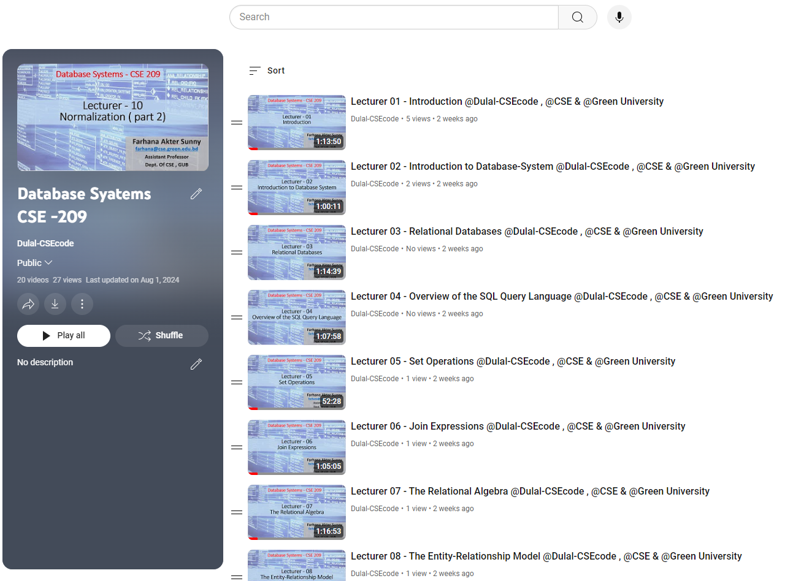

<h1 align="center">Database Systems - CSE 209</h1>  
<h3 align="center">Spring 2023</h3>  
<br />  
Welcome to the **Database Systems CSE-209** repository. This repository contains course materials, assignments, and resources for the Database Systems course.  
<br />  

<p align="center">
  
</p>  

<br />  

## Table of Contents
- [Introduction](#introduction)
- [Course Outline](#course-outline)
- [Installation](#installation)
- [Prerequisites](#prerequisites)
- [Assignments and Practice Problems](#assignments-and-practice-problems)
- [Usage](#usage)
- [Contributing](#contributing)
- [License](#license)

## Introduction

In this course, we will explore the fundamental concepts of database systems, including relational databases, SQL, database design, transaction management, and more. The repository provides a comprehensive guide to understanding and applying these principles through practical problem-solving.

Check out the playlist now and start your learning journey: [Database Systems CSE-209 Youtube Playlist Link : ](https://youtube.com/playlist?list=PLEc-WcPXUsjudQq6T7QiXQO0ysYVOq1UX&si=C6FWMb5fpk5RJ-vM) **Happy Learning!**

## Course Outline

### 1. Introduction to Database-System Applications
- **Text:** 1.1
  - Suggested Problems: 1.1, 1.3, 1.5, 1.8, 1.13
  - Outcome: CO1
  - Topics: Purpose of Database Systems (1.2), Database Languages (1.4), Relational Databases (1.5)

### 2. Structure of Relational Databases
- **Text:** 2.1
  - Suggested Problems: 2.1, 2.2, 2.7, 2.8, 2.12, 2.13, 7.14
  - Outcome: CO1
  - Topics: Database Schema (2.2), Keys (2.3), Relational Query Languages (2.5)

### 3. Overview of the SQL Query Language
- **Text:** 3.1
  - Suggested Problems: 3.1, 3.3, 3.4
  - Outcome: CO1, CO3
  - Topics: SQL Data Definition (3.2), Basic Structure of SQL Queries (3.3), Additional Basic Operations (3.4)

### 4. Set Operations
- **Text:** 3.5
  - Suggested Problems: 3.8, 3.9, 3.11, 3.12
  - Outcome: CO1, CO3
  - Topics: Aggregate Functions (3.6), Nested Subqueries (3.7), Modification of the Database (3.8)

### 5-6. Join Expressions
- **Text:** 4.1
  - Suggested Problems: 4.6, 5.4, 5.6
  - Outcome: CO1, CO3
  - Topics: PL/SQL (5.2), Functions and Procedures (5.2), Triggers (5.3)

### 7-9. The Relational Algebra
- **Text:** 6.1
  - Suggested Problems: 6.5, 6.6, 6.16, 2.6
  - Outcome: CO1, CO3
  - Topics: The Tuple Relational Calculus (6.2), The Domain Relational Calculus (6.3)

### 10-11. Overview of the Design Process
- **Text:** 7.1
  - Suggested Problems: 7.1, 7.3, 7.7, 7.12, 7.13, 7.18, 7.19, 7.22
  - Outcome: CO3, CO4
  - Topics: The Entity-Relationship Model (7.2), Constraints (7.3), Removing Redundant Attributes in Entity Sets (7.4), Entity-Relationship Diagrams (7.5), Entity-Relationship Design Issues (7.6), Translation of ER Diagram to Relational Schema (Reference-6)

### 12-13. Features of Good Relational Designs
- **Text:** 11.1
  - Suggested Problems: 11.3, 11.4, 11.6
  - Outcome: CO2, CO3
  - Topics: Ordered Indices (11.2), B+-Tree Index Files (11.3), Static Hashing (11.6), Dynamic Hashing (11.7), Comparison of Ordered Indexing and Hashing (11.8)

### 14-15. Measures of Query Cost
- **Text:** 12.2
  - Suggested Problems: 12.3, 12.10, 13.4, 13.5
  - Outcome: CO2, CO3
  - Topics: Selection Operation (12.3), Join Operation (12.5), Estimating Statistics of Expression Results (13.3)

### 16. Transaction Concept
- **Text:** 14.1
  - Suggested Problems: 14.3, 14.4, 14.8
  - Outcome: CO1, CO2
  - Topics: A Simple Transaction Model (14.2), Storage Structure (14.3)

### 17. Transaction Atomicity and Durability
- **Text:** 14.4
  - Suggested Problems: 14.12, 14.15, 14.20
  - Outcome: CO1, CO2
  - Topics: Transaction Isolation (14.5), Serializability (14.5)

### 18-19. Lock-Based Protocols
- **Text:** 15.1
  - Suggested Problems: 15.20
  - Outcome: CO1, CO2
  - Topics: Deadlock Handling (15.2), Timestamp-Based Protocols (15.4)

### 20-21. Centralized and Client–Server Architectures
- **Text:** 17.1
  - Outcome: CO1
  - Topics: Server System Architectures (17.2), Parallel Systems (17.3), Distributed Systems (17.4)

### 22-24. Decision-Support Systems
- **Text:** 20.1
  - Outcome: CO1
  - Topics: Data Warehousing (20.2), Data Mining (20.3)

## Installation

To set up the environment:

1. Clone the repository:
   ```bash
   git clone https://github.com/Dulal-CSEcode/Database-Systems-CSE-209.git
   cd Database-Systems-CSE-209
    ```

2. Install any required packages or dependencies. For example, on a Debian-based system:

    ```bash
    sudo apt-get update
    sudo apt-get install postgresql
    ```

## Prerequisites

Before you begin, ensure you have met the following requirements:

- You have a basic understanding of programming concepts.
- You have access to a database management system (DBMS).
- You have a basic understanding of SQL.
- You have Git installed on your computer.

## Assignments and Practice Problems

This repository includes a collection of assignments and practice problems to help reinforce the concepts taught in the course. Each assignment is located in its respective directory with detailed instructions and resources.

## Usage
Navigate to the specific assignment or practice problem directory and follow the instructions provided in the README.md file located in each folder.

## Contributing
Contributions are welcome! To contribute, please follow these steps:

1. Fork the repository.

2. Create a new branch (e.g., feature-branch).

3. Make your changes and commit them (git commit -m 'Add new feature').

4. Push to the branch (git push origin feature-branch).

5. Create a pull request.

Please ensure your code follows the repository's coding standards and includes appropriate tests.

## License
This project is licensed under the MIT License. See the LICENSE file for more details.

<br/>
<h2 align="center">Thanks for visiting the Database Systems - CSE 209 repository.</h2>
<h3 align="center">© All rights reserved by Dulal-CSEcode @2024 © Department of Computer Science and Engineering, GUB</h3>
